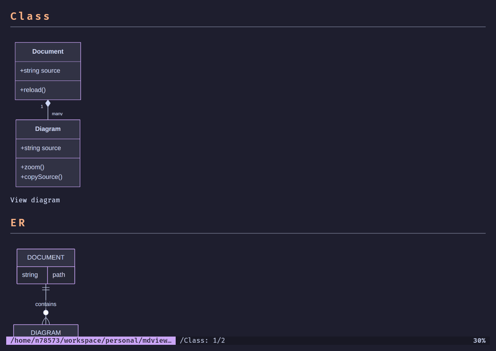
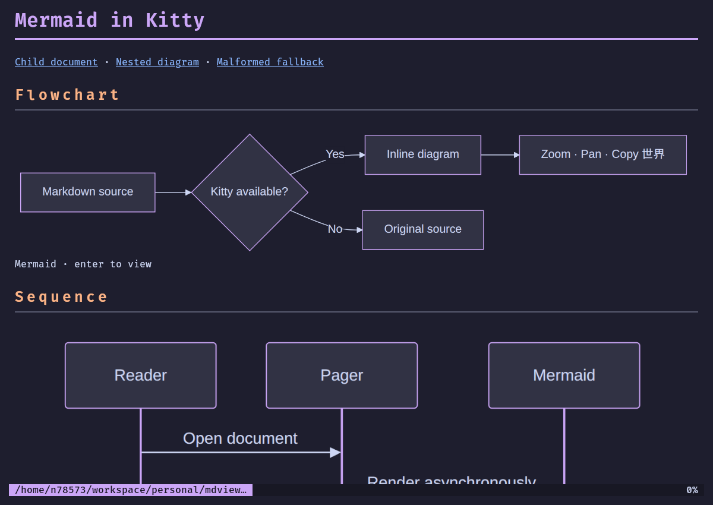
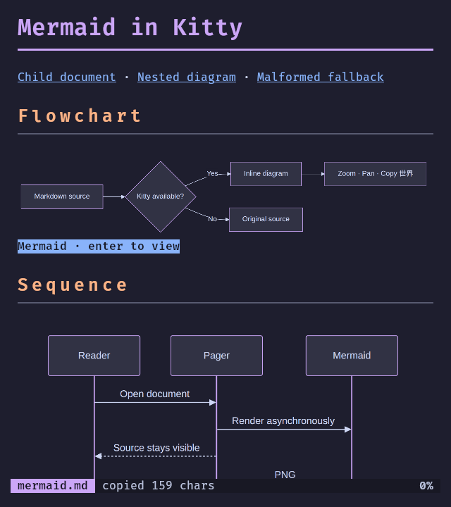
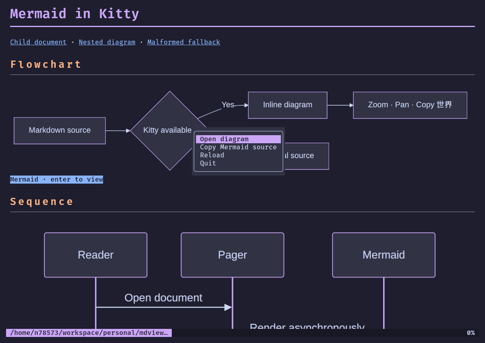
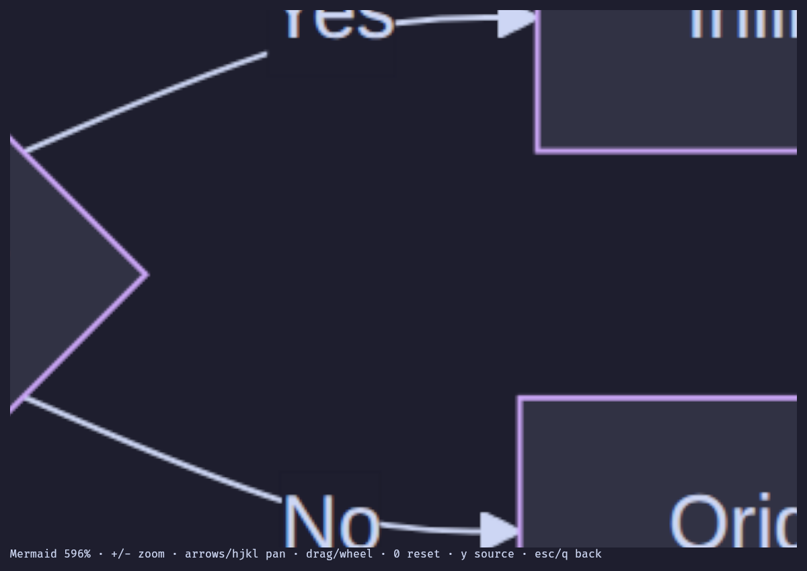

# Mermaid verification — 2026-09-24

Implemented and installed at `/home/n78573/go/bin/mdview`, preserving the
pre-existing breadcrumb changes. The installed executable matches the tested
build (SHA-256 `184967faad1d2b69bf54a6ffa0e7e144c3f1ade1319f1a682551809a0094d033`).

## Inline sizing correction

After a report of an oversized class chart, inline layout now caps diagram
magnification at its natural CSS-pixel size (PNG dimensions divided by the
renderer’s 2× raster scale). Wide charts still shrink to the available width;
tall charts remain scrollable. The separate viewer still fits the available
screen and supports zoom. Narrow captions use “View diagram”.

The class chart was visually checked in real Kitty at 1200×850 and 640×720,
including viewer open/return. Tests cover narrow class charts, wide Gantt charts,
nested widths, tall charts, and independent viewer magnification. All Go tests,
race tests, vet, and build checks passed again before installation.

The earlier screenshots below document the initial interaction verification;
inline chart sizes in them predate this correction.

## Automated checks

Passed:

- `go test ./...`
- `go test -race ./...`
- `go vet ./...`
- `go build -o /tmp/mdview-mermaid .`
- `MDVIEW_TEST_MMDC=1 go test ./mermaid -run TestRealCLI -v -count=1`
- Installed executable: help/flag discovery, printed output, and the Kitty
  interaction journey below.

Tests cover nested/repeated block metadata, fallback and source search,
renderer failure/timeout/cancellation, at-most-two concurrency, stale results,
cache reuse/eviction, cell sizing, partial visibility, PNG tiling, frame
serialization, cleanup before leaving the alternate screen, asynchronous
scroll preservation, overlays, source copy, zoom/pan limits, mouse input,
viewer return, resize, navigation, breadcrumbs, and reload.

Real Mermaid rendering passed for flowchart, sequence, class, ER, state, and
Gantt diagrams, Unicode labels, both palettes, and malformed-input rejection.
Normal tests do not require Mermaid or Node.

## Actual Kitty verification

Kitty 0.48.2 rendered actual PNG graphics, first in a desktop window and then
on an isolated Xvnc X11 display to avoid interrupting the user's desktop.
These checks used screenshots of real Kitty windows, not just PTY transcripts.
This is software-rendered GUI verification, not a hardware-GPU benchmark.
Older Kitty versions were not separately exercised.

The installed binary passed:

- Inline flowchart and sequence graphics at 1200×850 and 640×720 window sizes,
  with ordinary/scaled headings and partially visible image rows.
- Caption focus/Enter, repeated opening, fitted view, 596% zoom across PNG tile
  boundaries, arrow panning, reset, and return with `esc` or `q`.
- Right-click menus over diagrams without image corruption; source copy from
  both the menu and viewer verified through the X clipboard, including Unicode
  and absence of image placeholders.
- Source search, nested quoted-list indentation, navigation to another diagram
  document and then a third document, and direct breadcrumb return.
- Malformed Mermaid retaining searchable source.

Additional real Kitty checks passed with `-mermaid off`, no `mmdc` on `PATH`,
tmux/screen environment markers, and a non-Kitty `TERM`. All retained source
without images. Piped output and `-pager never` likewise retained source with
no renderer messages. Invalid `-mermaid` values were rejected.

Latte diagrams and live reload were also checked: changing a document while
its diagram viewer was open closed the obsolete viewer and showed the new
text; adding a new diagram rendered the replacement without stale images.

## Local dependencies

Verified with Go 1.27.1, Node 26.5.0, Mermaid CLI 11.17.0, Puppeteer 25.11.0,
and system Chromium 151.0.7922.71 on Linux/amd64.

Mermaid/Puppeteer were installed under
`/home/n78573/.local/share/mdview/mermaid`. The local
`/home/n78573/.local/bin/mmdc` launcher invokes that pinned CLI and defaults
`PUPPETEER_EXECUTABLE_PATH` to `/usr/bin/chromium-browser`; an explicitly set
value takes precedence. Chromium was already installed and was functionally
verified. No browser download is needed with this setup. mdview itself never
installs dependencies.

Kitty's Unicode virtual placements ignore source crop coordinates. Large
placements therefore use cropped PNG tiles with complete placeholder
coordinates; using only crop options would silently produce incorrect zoom.
Both Go-side and terminal image resources have bounded caches. Individual
PNGs beyond Kitty's 10,000-pixel dimension limit or the session budget remain
as source.
