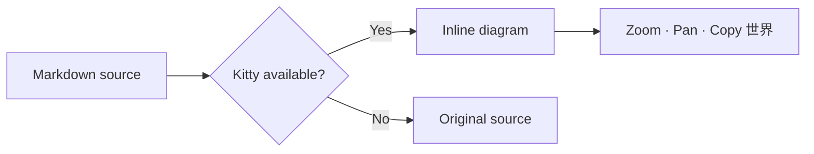
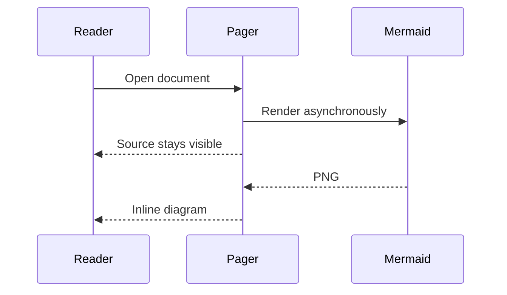
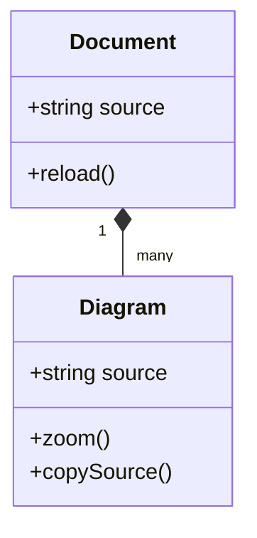
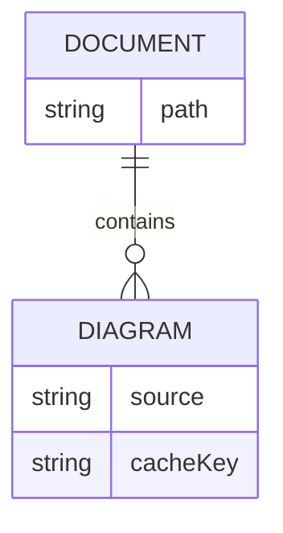
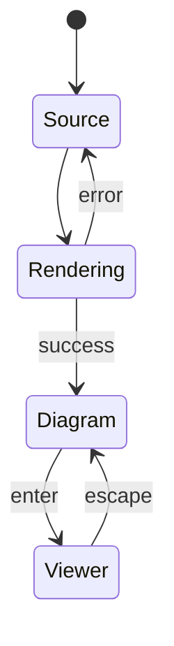
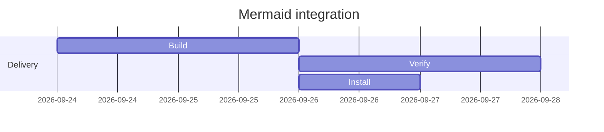
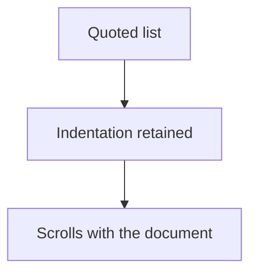

# Mermaid in Kitty

[Child document](mermaid-child.md) · [Nested diagram](#nested) · [Malformed fallback](#malformed)

## Flowchart



## Sequence



## Class



## ER



## State



## Gantt



## Nested

> A diagram in a quoted list:
>
> - ```mermaid
>   flowchart TD
>       A[Quoted list] --> B[Indentation retained]
>       B --> C[Scrolls with the document]
>   ```

## Repeated



## Malformed

This block intentionally stays as source without a notification.

```mermaid
flowchart LR
    A --> [
```

## End

[Back to top](#mermaid-in-kitty)
